<div align="center">
 <h1>PyTurnstile</h1>
 <a href="https://pypi.org/project/pyturnstile" target="_blank">
    
 </a>
 <p>A Python library for validating <a href="https://developers.cloudflare.com/turnstile/">Cloudflare Turnstile</a> tokens with both async and sync support.</p>

<a href="https://github.com/dong-chen-1031/pyturnstile/actions?query=workflow%3ATest+event%3Apush+branch%3Amain" target="_blank">
    
</a>
<a href="https://pypi.org/project/pyturnstile" target="_blank">
    
</a>
<a href="https://pypi.org/project/pyturnstile" target="_blank">
    
</a>
<a href="https://docs.astral.sh/ruff/" target="_blank">
    
</a>

<a href="https://github.com/dong-chen-1031/pyturnstile/pulls" target="_blank">
 
</a>
</div>

## Features

- 🔄 Async & Sync Support
- 🚀 Simple API
- 📦 Lightweight - Only requires `httpx`

## What is PyTurnstile?

PyTurnstile simplifies Cloudflare Turnstile token validation. It handles all communication with Cloudflare's API.

```mermaid
sequenceDiagram
    participant Frontend as 🖥️ Frontend
    participant Backend as 🐍 Your Backend
    participant Cloudflare as ☁️ Cloudflare

    Frontend->>Cloudflare: 1. Complete challenge
    Cloudflare-->>Frontend: 2. Return token
    Frontend->>Backend: 3. Submit form + token

    rect rgb(50, 179, 238)
        Note over Backend,Cloudflare: 🔍 PyTurnstile handles this
        Backend->>Cloudflare: 4. Verify token
        Cloudflare-->>Backend: 5. Valid ✅ / Invalid ❌
    end

    Backend->>Frontend: 6. Allow / Deny request
```



> Learn more at: https://developers.cloudflare.com/turnstile/

## Installation

Install the package using your preferred dependency manager.

### uv

```bash
uv add pyturnstile
```

### pip

```bash
pip install pyturnstile
```

## Usage

> [!TIP]
> You can follow [this documentation](https://developers.cloudflare.com/turnstile/get-started/) and create your own Turnstile secret key at the [Cloudflare Turnstile dashboard](https://dash.cloudflare.com/?to=/:account/turnstile).

### Quick Start

PyTurnstile provides two ways to validate tokens:

#### 1. Using the `Turnstile` class (Recommended)

```python
from pyturnstile import Turnstile

# Initialize with your secret key
turnstile = Turnstile(secret="your-secret-key")

# Validate a token (asynchronously)
response = await turnstile.async_validate(token="user-token-from-frontend")

# or validate synchronously
# response = turnstile.validate(token="user-token-from-frontend")

if response.success:
    print("✅ Token is valid!")
```

#### 2. Using functions directly

```python
from pyturnstile import validate, async_validate

# Validate a token (asynchronously)
response = await async_validate(
    token="user-token-from-frontend",
    secret="your-secret-key"
)

# or validate synchronously
# response = validate(
#     token="user-token-from-frontend",
#     secret="your-secret-key"
# )

if response.success:
    print("✅ Token is valid!")
```

### Optional Parameters

> [!NOTE]
> For more details on all available parameters, see the [Cloudflare Turnstile documentation](https://developers.cloudflare.com/turnstile/get-started/server-side-validation/#required-parameters)

```python
response = turnstile.validate(
    token="user-token",            # The token from the client-side widget
    remoteip="203.0.113.1",        # Optional: visitor's IP address
    idempotency_key="unique-uuid", # Optional: for retry protection
    timeout=10                     # Optional: request timeout in seconds
)
```

### Response Object

> [!NOTE]
> For more details on all response fields, see the [Cloudflare Turnstile documentation](https://developers.cloudflare.com/turnstile/get-started/server-side-validation/#response-fields)

The `TurnstileResponse` object contains:

```python
response.success                   # bool: Whether validation succeeded
response.error_codes               # list[TurnstileErrorCodes]: Error codes (if any)
response.challenge_ts              # str: ISO timestamp of challenge completion
response.hostname                  # str: Hostname where challenge was served
response.action                    # str: Custom action identifier
response.cdata                     # str: Custom data payload from client-side
response.metadata["ephemeral_id"]  # Device fingerprint ID (Enterprise only)
```

## Contributing

Any contributions are greatly appreciated. If you have a suggestion that would make this project better, please fork the repo and create a Pull Request. You can also [open an issue](https://github.com/Dong-Chen-1031/pyturnstile/issues).

## License

Published under the [MIT License](LICENSE).
